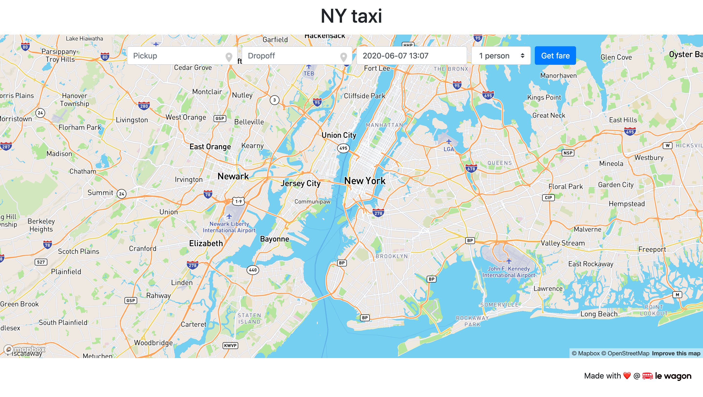

# NY Taxi Fare prediction interface



## Setup

The interface uses 4 APIs:

- The NY Taxi Fare prediction API
- The [Algolia Places](https://community.algolia.com/places/) API for address autocomplete
- The [MapBox Maps API](https://docs.mapbox.com/mapbox-gl-js/api/) to display a map
- The [MapBox Directions API](https://docs.mapbox.com/api/navigation/) to display the route on the map

These APIs require credentials and the following steps will guide you to get them and set the interface with.

### Algolia Places Api

- Go to [Algolia](https://www.algolia.com/) and create an account and follow the steps to create your first application
- Go to your [dashboard](https://www.algolia.com/) then to the API Keys tab
- Grab an `Application ID` and a `Search-Only API Key` then set them into the `script.js`

```javascript
const algoliaPlacesApiAppId = 'YOUR_APPLICATION_ID';
const algoliaPlacesApiKey = 'YOUR_SEARCH_ONLY_API_KEY';
````

### MapBox Maps and Directions APIs

- Go to [MapBox](https://www.mapbox.com/) and create an account
- Go to your [Account](https://account.mapbox.com/) and grab your `Access Token` then set it into the `script.js`

```js
//...
const mapboxApiToken = 'pk.eyJ1Ijoia3Jva3JvYiIsImEiOiJjam83MjVrbWkwbWNoM3FwN2VhMm81eGRzIn0.yM3wkq5LJd8NeSYyPyTY4w';
````

## Local development

To check your setup, run the interface locally with `serve`. Then go to [http://localhost:8000](http://localhost:8000).

## Deploy on GitHub Pages

Your app is ready to go live!

Create a new branch `gh-pages`:

```bash
git checkout -b gh-pages
```

Deploy your app on GitHub:

```bash
git push origin gh-pages
```

Your app will be visible shortly at `https://YOUR_GITHUB_NICKNAME.github.io/taxi-fare-interface`.


